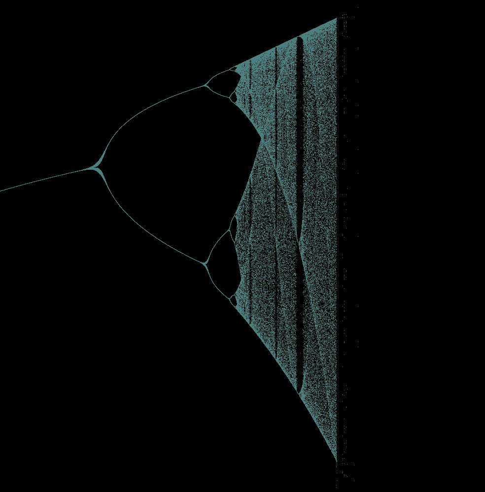

# Logistic Map
Rendering of a Newton Fractal using OpenGL
### System Requirements
-  Operating System : Linux/ Windows
-  Programming Language : C/C++
-  Graphics API : OpenGL 4.4
-  Library : GLFW
- Build system: Solution file(Visual Studio), CMake & Makefile(build.bat)

### Build Process(Windows)
#### Visual Studio
- Build using visual studio in **Release** mode and run the exe in ```build``` directory

#### Command Line(Windows)
You either need to use ```x64 Command prompt for VS``` or need to install ```clang``` to build the project using command line.
- Navigate to the source directory from the command line 
- Run the ```build.bat``` file from the project directory

### Output
  

### Controls
```Scroll```- For zoom in and out  
```W A S D```-Movement

### References
[Veritasium Video](https://youtu.be/ovJcsL7vyrk)
